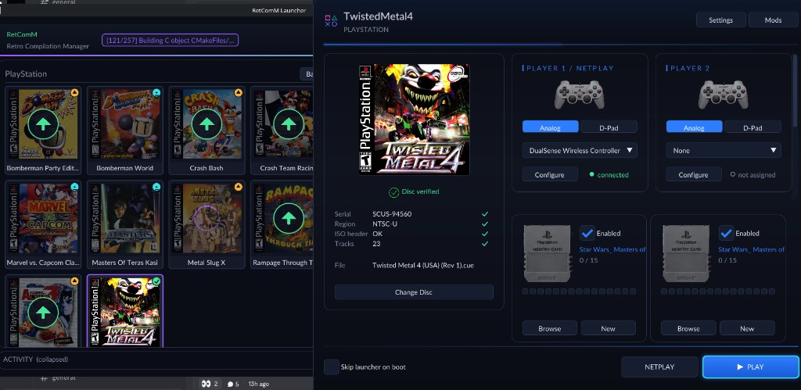
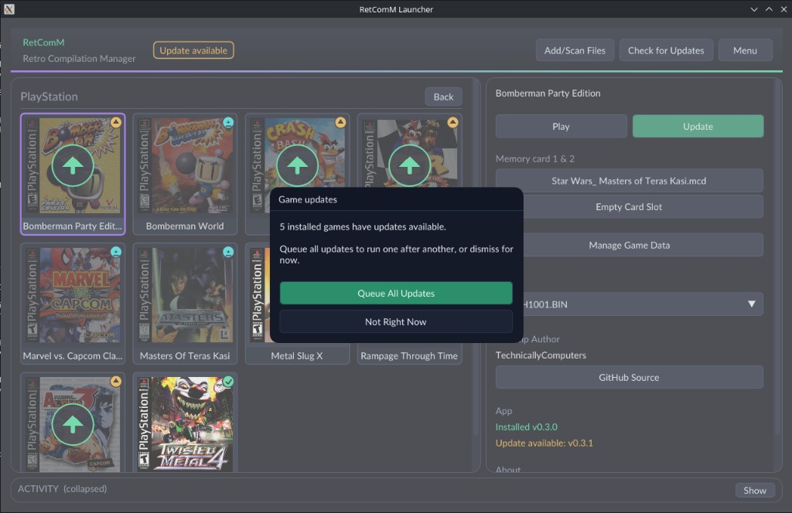
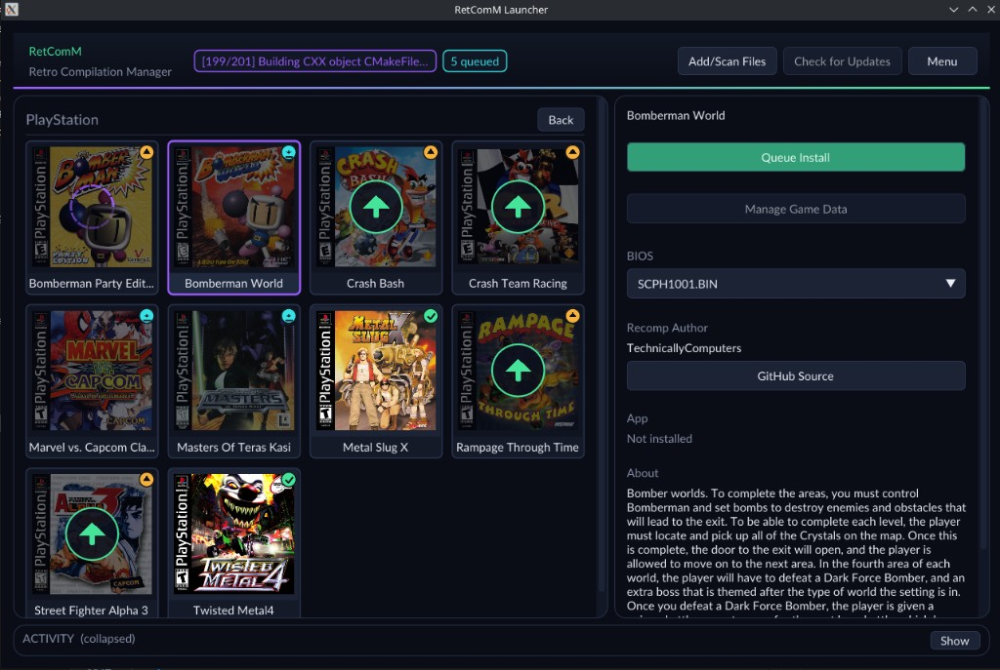
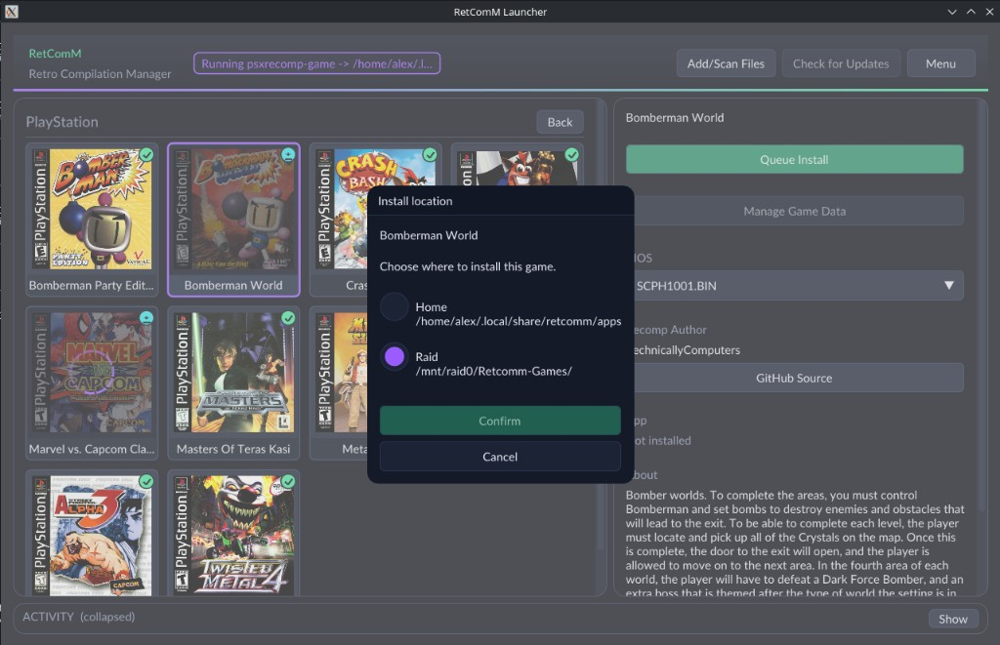
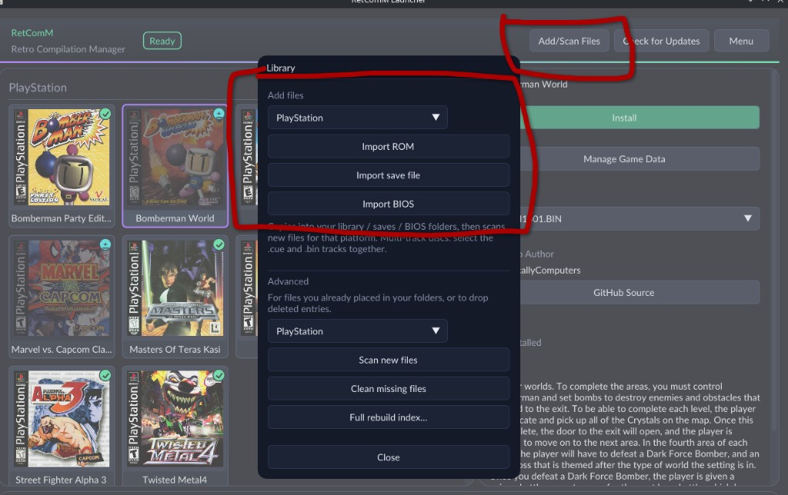
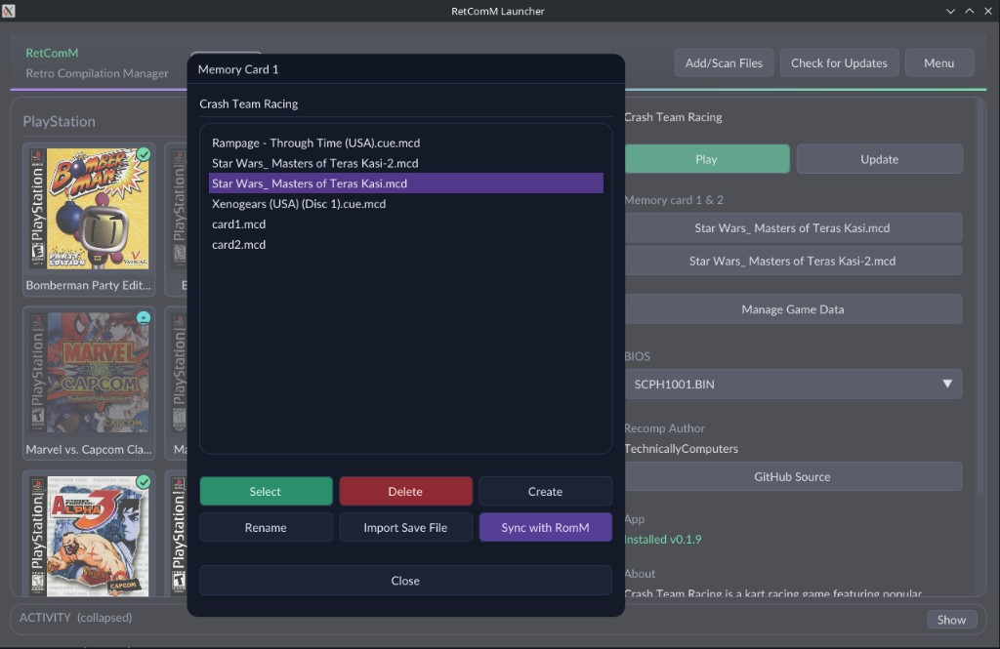

# RetComM Launcher

[](https://github.com/TechnicallyComputers/RetComM-Launcher/releases)
[](https://github.com/TechnicallyComputers/RetComM-Launcher/releases/latest)
[](https://github.com/TechnicallyComputers/RetComM-Launcher/releases/latest)

[](https://github.com/TechnicallyComputers/RetComM-Launcher/releases/latest)
[](https://github.com/TechnicallyComputers/RetComM-Launcher/releases/latest)
[](https://github.com/TechnicallyComputers/RetComM-Launcher/releases/latest)
[](https://github.com/TechnicallyComputers/RetComM-Launcher/releases/latest)
[](https://github.com/TechnicallyComputers/RetComM-Launcher/releases/latest)

RetComM Launcher uses the SignPath Foundation for code signing.

**RetComM — Retro Compilation Manager** catalogs and installs recomps that
**self-compile on the end user’s machine**. For liability reasons we encourage
releases that do **not** ship machine-generated C derived from proprietary
software; users generate that code locally instead. First installs can take
**5–10 minutes**, which is a lot to manage by hand — this hub exists to make
that workflow practical.

RetComM checks for updates, rebuilds with **existing build data** when
possible, shares the same **portable toolchain** used by per-title self-compiling
launchers, and automates BIOS/ROM wiring so you are not stuck in each game’s
Generate & Build wizard.

```
RetComM Launcher          →  catalog / install / queue / update / launch
        │
        ▼
each recomp/decomp exe    →  recomp-ui (settings, disc verify, PLAY)
```

Windows, Linux, and macOS builds are available from
[Releases](https://github.com/TechnicallyComputers/RetComM-Launcher/releases).
Feedback is welcome while the project keeps evolving.

<p align="center">
  
</p>

## Why self-compiling?

Shipping pre-generated recomp C from commercial ROMs is a legal grey area we
prefer to avoid. Catalog titles that use **psxrecomp + recomp-ui** (and similar
self-compiling stacks) ask each user to generate and compile on their own PC.
RetComM’s job is to make that tolerable: shared toolchains, shared engine
source (one `psxrecomp` / `recomp-ui` pin across titles), incremental rebuilds,
queued installs, and automatic ROM/BIOS/save plumbing.

Submit a title via the
[catalog submission form](https://technicallycomputers.github.io/retcomm-catalog/submit/).
psxrecomp + recomp-ui projects can auto-fill most fields. Other self-compiling
launchers can still be listed so RetComM fetches releases/updates and hands users
off to that title’s install flow as gracefully as possible.

## Features

### Queue installs & updates; play while builds run

Queue every pending update at once, or queue Install/Update for individual
titles anytime. Builds and installs continue in the background while you browse
the library and launch other games. Builds are CPU-heavy — expect some lag until
they finish.

<p align="center">
  
</p>

<p align="center">
  
</p>

### Install locations

ROM/BIOS/save libraries stay in your emulation tree. Recomp app data can install
under the default apps folder or extra roots you add in Library Settings (e.g. a
fast SSD). When more than one root is configured, Install asks where to put the
title.

<p align="center">
  
</p>

### Library import & scan

**Easy Install** scaffolds a common EmulationStation-style folder layout.
Advanced users can point RetComM at an existing ES-DE / RomM-style library and
map platform folders. Import ROMs, saves, and BIOS dumps from **Add/Scan Files**;
files are hashed, indexed, and stored in your library directories. Scan also picks up
files you placed on disk manually.

<p align="center">
  
</p>

### Memory cards & save management

Pick memcards (or cart battery files) per title, create/rename/import saves, and
optionally **two-way sync with [RomM](https://romm.app/)** via the RomM API.
Saves and configs are preserved across app updates, and uninstall can keep them
for a later reinstall.

<p align="center">
  
</p>

### BIOS, OpenBIOS, and hot-swap

Install with bundled **OpenBIOS**, then add a retail dump such as `SCPH1001.BIN`
later and RetComM can prompt a rebuild with SCPH support. After that, hot-swap
between BIOS choices in the hub (Play stages an empty `bios.cfg` for OpenBIOS so
a prior SCPH pick cannot stick). Online lobbies settle one match BIOS: OpenBIOS
unless every seated peer can run SCPH-1001 and nobody selected OpenBIOS.

### RomM integration

With a RomM base URL + client API token, RetComM can:

- Match catalog titles to your RomM library by hash (fast — RomM already hashed them)
- Download matching ROMs and BIOS into your library
- Bidirectionally sync native saves (newer wins)

### Toolchain, rebuilds, and preservation

RetComM uses the same portable toolchain packs as the per-title self-compiling
launchers. It preserves cmake/build intermediates when possible so updates rebuild
faster, wires ROMs and BIOS automatically, and skips the per-game Generate & Build
wizard when you manage installs through the hub.

### Catalog, boxart, and power-user options

Remote catalog from
[`retcomm-catalog`](https://github.com/TechnicallyComputers/retcomm-catalog),
automatic boxart (Libretro by default; optional RomM covers or local art),
uninstall with keep-saves, and deeper options under **Menu** (library roots,
exclude dirs, update checks, etc.).

## Coming soon

- **Centralized per-platform config** — preferred render/controller/hotkey defaults
  applied at launch, with optional per-game blacklist for power users
- **Mod management** and optional launcher bypass when RetComM owns configuration
- **Centralized netplay lobby** — stay in one lobby, hot-swap titles after a match,
  filter by player count / shared library, backwards compatible with each game’s
  built-in lobby

## Downloads

| Artifact | Platform |
|---|---|
| `RetComM-Launcher-linux-x86_64.AppImage` | Linux |
| `RetComM-Launcher-windows-x64-setup.exe` | Windows installer |
| `RetComM-Launcher-portable-windows.zip` | Windows portable (`RetComM Launcher.exe` inside) |
| `RetComM-Launcher-macos-arm64.dmg` | macOS Apple Silicon |
| `RetComM-Launcher-macos-x86_64.dmg` | macOS Intel |

Releases are published manually via Actions → **Release**. Leave **version**
empty to auto-bump the next `x.x.x` from the latest `vX.Y.Z` tag (`bump`
defaults to patch). Hub **Update RetComM** pulls the matching asset for your
install channel. Windows portable: unzip and run `RetComM Launcher.exe` (hub),
or `RetComM Launcher.exe cli <command>` for the CLI (same idea as the Linux
AppImage `cli` dispatch).

## Build from source

```sh
cmake -G Ninja -S . -B build
cmake --build build -j
./build/retcomm --help
./build/retcomm-hub   # SDL3 + ImGui dashboard
```

Requires CMake 3.24+, a C++17 compiler, and **libcurl**. Runtime archive tools:
`bsdtar` (preferred), `unzip`, or `7z`. Update *checks* (catalog / launcher /
toolchain / game tags) use `github.com` redirects and do not need a token.
Optional GitHub PAT for `api.github.com` when listing/downloading release
assets: Library Settings → **GitHub token**, `config.json` `github_token`, or
env `GITHUB_TOKEN` / `GH_TOKEN` (env wins). Hub UI needs system **SDL3** + OpenGL and Dear ImGui (sibling
`../recomp-ui`, or CMake FetchContent). Wine installs need `wine` / `wine64` on
`PATH`.

Packaging lives under `packaging/`; icon source is `assets/retcomm.svg`.

## Quick start (CLI)

```sh
./build/retcomm list
./build/retcomm catalog update

mkdir -p ~/.config/retcomm
cp config.example.json ~/.config/retcomm/config.json
# edit library_root / bios_root / saves_root / platform_folders

./build/retcomm scan
./build/retcomm bios scan
./build/retcomm library
./build/retcomm install masters-of-teras-kasi-psx
./build/retcomm launch masters-of-teras-kasi-psx
./build/retcomm uninstall masters-of-teras-kasi-psx   # keeps saves by default
```

`launch` stages disc/ROM/BIOS sidecars next to the install and prefers a companion
`.cue` for disc titles. Installs land under
`~/.local/share/retcomm/apps/<install_dir>/` (or your configured install roots)
with `releases/<tag>/`, a `current` link, and `install.json`.

Scan walks only the platform folders the catalog needs, skips junk dirs, and
hashes when identity digests are present. Results go to
`library-index.json` with incremental cache hits; use `scan --full` (or hub
**Full rebuild index**) to rehash everything.

## Catalog

Titles live in
[`retcomm-catalog`](https://github.com/TechnicallyComputers/retcomm-catalog),
not this repo. The launcher caches `catalog.zip` under
`~/.local/share/retcomm/catalog/` and can auto-update on startup.

```json
"catalog": {
  "url": "https://github.com/TechnicallyComputers/retcomm-catalog/releases/latest/download/catalog.zip",
  "github_repo": "TechnicallyComputers/retcomm-catalog",
  "auto_update": true
}
```

Overrides: `--catalog DIR`, `$RETCOMM_CATALOG`.

## Data dirs

| Role | Linux |
|---|---|
| Config | `~/.config/retcomm/` |
| Installs + state | `~/.local/share/retcomm/` |
| Catalog cache | `~/.local/share/retcomm/catalog/` |

See [`docs/ARCHITECTURE.md`](docs/ARCHITECTURE.md),
[`docs/CATALOG.md`](docs/CATALOG.md), and
[`docs/BUILD_PACKS.md`](docs/BUILD_PACKS.md).

## Layout

```
docs/                   architecture, catalog notes, screenshots/
src/                    CLI + core + hub
include/retcomm/        public headers
assets/                 app icon + hub assets
packaging/              AppImage, DMG, Windows helpers
.github/workflows/      Release CI
```

## License

RetComM Launcher is released under the [MIT License](LICENSE).
